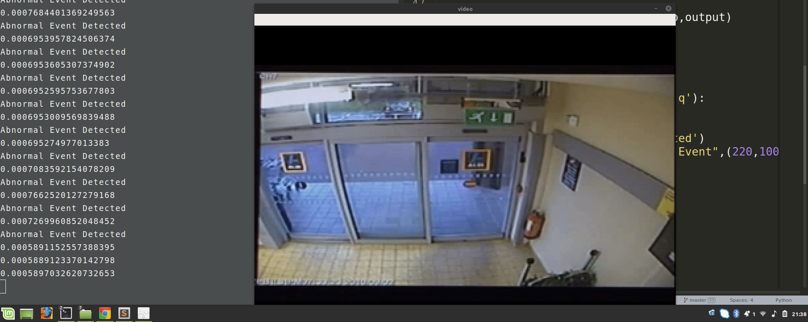

# Apprentissage Profond Et Video Surveillance

Nous analyserons le flux vidéo en temps réel et identifierons toute activité anormale comme la violence ou le vol.

## Network architecture:

Pour ce projet de vidéosurveillance, nous introduirons un auto-encodeur spatio-temporel, basé sur un réseau de convolution 3D. La partie codeur extrait les informations spatiales et temporelles, puis le décodeur reconstruit les frames. Les événements anormaux sont identifiés en calculant la perte de reconstruction à l'aide de la distance euclidienne entre le lot d'origine et le lot reconstruit.

Maintenant, exécutez ce script et observez les résultats de la vidéosurveillance, il mettra en évidence les événements anormaux.

